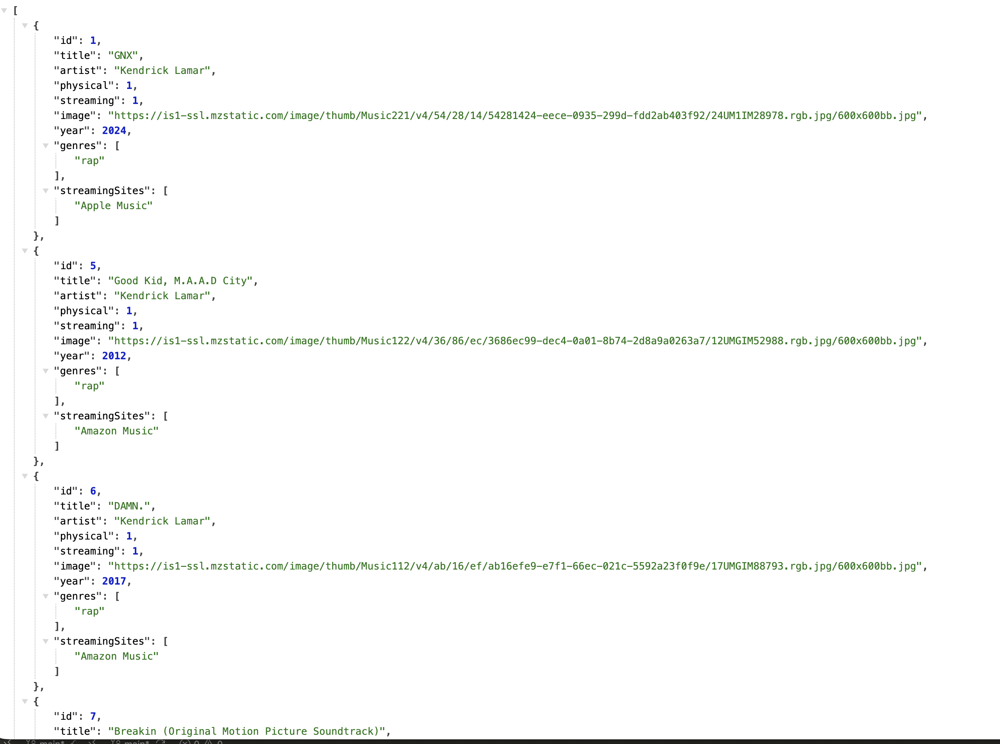

# Needle Drop — API

The backend REST API for **Needle Drop**, a personal music collection catalog. It serves album data — including genres and streaming sites — and supports searching and filtering.

Frontend repo: [album-app-frontend](https://github.com/theKHutDeveloper/album-app-frontend)

Example response from /api/albums?genre=rap


## Tech stack

- **Node.js** + **Express** — REST API
- **express-rate-limit** — basic rate limiting on the API
- **SQLite** (via `sqlite` / `sqlite3`) — database
- Normalised schema with junction tables for genres and streaming sites

## Getting started

### Prerequisites

- Node.js (LTS — v20.19+ or v22+)

### Installation

```bash
git clone git@github.com:theKHutDeveloper/album-app.git
cd album-app
npm install
```

### Seed the database

Populate the database from the album data file. This creates the tables and inserts the albums:

```bash
node db/seed.js
```

### Run the server

```bash
npm start
```

The API runs at `http://localhost:8000`.

## API endpoints

All requests are rate limited to 100 requests per 15 minutes per IP.

### `GET /api/albums`

Returns all albums, each with nested `genres` and `streamingSites` arrays.

Supports the following optional query parameters, which can be combined:

| Parameter   | Description                             | Example                       |
| ----------- | --------------------------------------- | ----------------------------- |
| `genre`     | Filter by genre name                    | `/api/albums?genre=rap`       |
| `physical`  | Filter to albums owned physically       | `/api/albums?physical=1`      |
| `streaming` | Filter to albums available on streaming | `/api/albums?streaming=1`     |
| `search`    | Search by album title or artist         | `/api/albums?search=kendrick` |

Filters combine, so `/api/albums?genre=rap&search=damn` returns rap albums matching "damn".

### `GET /api/albums/genres`

Returns the full list of genres.

## Project structure

```
album-app/
├── controllers/     # Request handlers
├── db/
│   ├── connection.js   # Database connection (shared, foreign keys enabled)
│   ├── schema.sql      # Table definitions
│   └── seed.js         # Creates tables and seeds data
├── data/            # Album source data
├── routes/          # Express routes
├── utils/           # Helpers (e.g. grouping query results)
└── server.js        # App entry point
```

## Design Decisions

- SQLite — chose it for zero hosting cost and simplicity; the catalog is read-heavy so a shipped, pre-seeded database fits well.
- Raw SQL over an ORM — wrote queries by hand to strengthen SQL skills rather than abstracting them away.
- Normalised schema with junction tables — genres and streaming sites are many-to-many, so they live in their own tables; query results are reshaped in utils/groupAlbums.js into nested objects.
- Permissive CORS — the API is intentionally public, treated as a standalone resource that the frontend is one consumer of.
- Rate limiting — added because a public API should protect against abuse.

## License

[MIT](LICENSE)
